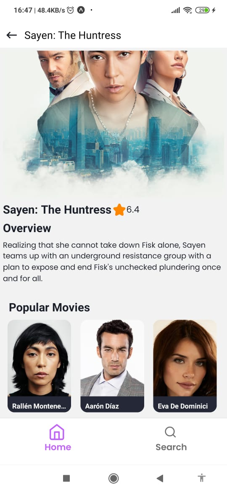

This is a Air Group Movie App project (React Native Expo)

## Getting Started

First, install dependecies:

```bash

yarn 

```
Once dependencies are installed, you can start the Expo server by running:

```bash

yarn start

```


### Included Key Components and Features

### This version specifies that Expo 49 was used for development and all components were coded using TypeScript.

- **Home Screen**: Displays sections for upcoming, popular, and now playing movies.

- **Search Screen**: Includes a search feature with debounce to optimize search requests and abort unnecessary requests using abort signal.

- **Theme**: App supports both dark and light modes.

- **Details Screen**: Provides information about the movie including cast members.

- **Custom Components**: Uses custom notification context to handle errors.




